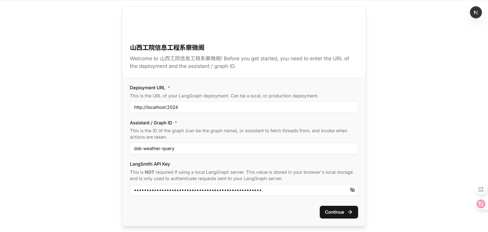
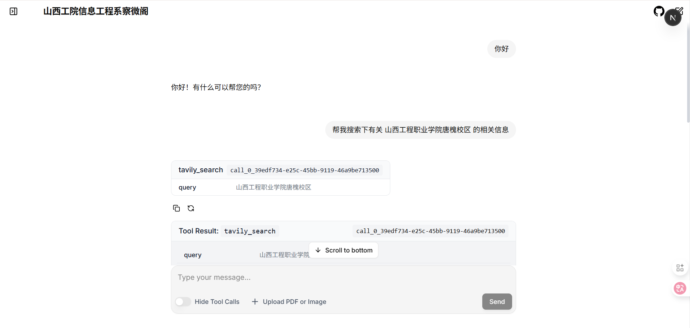
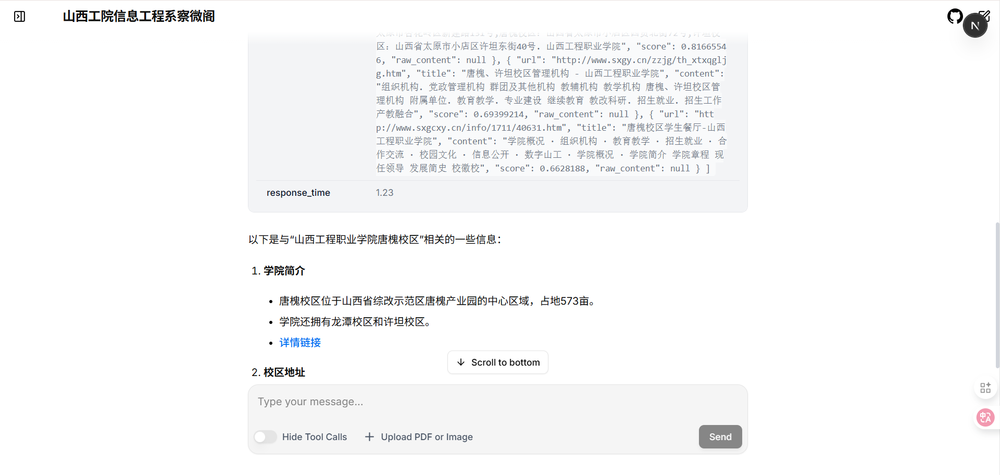

# lang-chain-sample

```shell
pip install langgraph # 0.5.4
pip show langgraph
pip install python-dotenv openai
pip install langchain
# https://python.langchain.com/docs/integrations/chat/
pip install langchain-deepseek
pip install langchain-qwq
pip install langchain-openai
pip install langchain-ollama
pip install -U langchain-tavily
pip install -U langgraph-cli[inmem]
```

# deploy to agent ui

```shell
git clone https://github.com/langchain-ai/agent-chat-ui.git && cd agent-chat-ui
node -v # v22.17.1
npm install -g pnpm
pnpm -v # 10.5.1
pnpm install
pnpm run dev
```





